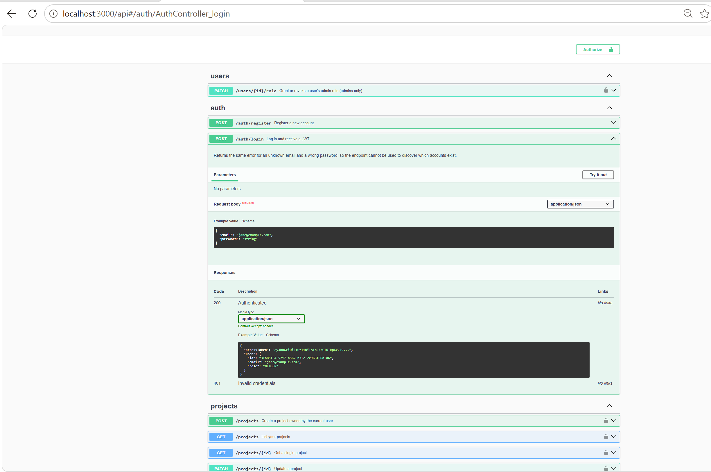

# BugTracker API

[](https://github.com/Premar19/bugtracker-nest-api/actions/workflows/ci.yml)

A multi-user issue-tracking REST API (a stripped-down Jira/Linear backend) built with **Nest.js**, **TypeScript**, and **PostgreSQL**.

`Nest.js` · `TypeScript` · `PostgreSQL` · `Prisma` · `JWT` · `Docker` · `Jest`

## Why this project

This project demonstrates a complete backend lifecycle: JWT authentication with bcrypt-hashed passwords, role-based and ownership-based access control, a relational schema (users → projects → issues) managed through Prisma migrations, request validation with DTOs, auto-generated OpenAPI docs, and a Jest unit + e2e test suite, all containerised with Docker Compose for one-command setup.

## Screenshot

_Swagger UI at `/api`, listing all endpoints grouped by `auth`, `projects`, and `issues`:_



> Need to run the app and open `http://localhost:3000/api` to see it live; drop a screenshot at `docs/swagger-screenshot.png` to render it here.

## Architecture

The code is organised the way Nest expects: one module per domain concern, each with its own controller, service, and DTOs.

```
src/
  auth/       # register, login, JWT strategy, guards, roles decorator
  users/      # user lookups, admin-only role management
  projects/   # project CRUD, ownership checks
  issues/     # issue CRUD, filtering, pagination
  prisma/     # PrismaService: a single injectable DB client
```

Nest's module + provider (dependency injection) system plays the same role a hand-rolled service layer would in a simpler framework. It just makes the separation of concerns and testability structural rather than a convention you have to enforce yourself.

**Access control** has three layers, and the split between them is deliberate:

- `JwtAuthGuard` on every `projects`/`issues`/`users` route: you must be authenticated.
- `RolesGuard` + `@Roles(Role.ADMIN)` on `PATCH /users/:id/role`: a pure role check, decided entirely from the JWT payload with no database access.
- **Ownership checks inside `ProjectsService`**: only a project's owner or an `ADMIN` can update or delete it. Issue creation/updates are open to any authenticated user, matching the brief's "members can create/update issues."

Role and ownership are enforced in *different layers* because they're different questions. "Are you an admin?" is answered by the token alone, so a guard can settle it before the request reaches a controller. "Do you own project X?" requires a database lookup, which a guard has no clean way to do, so it lives in the service, next to the data it needs.

**Bootstrapping the first admin:** role changes are admin-only, which leaves a chicken-and-egg problem, because a fresh database has no admin and so nobody can promote anyone. `npm run seed` resolves it by creating (or promoting) the account in `ADMIN_EMAIL`/`ADMIN_PASSWORD` directly. Admins also can't change their *own* role, so the last admin can't accidentally lock everyone out.

## Running it

**With Docker (one command):**

```bash
docker compose up --build
```

This builds the API image, starts Postgres, runs `prisma migrate deploy`, and boots the API on `http://localhost:3000`. Swagger docs live at `http://localhost:3000/api`.

**Locally, without Docker:**

```bash
cp .env.example .env         # adjust DATABASE_URL if needed
docker compose up -d postgres # or point DATABASE_URL at your own Postgres
npm install
npm run prisma:migrate
npm run seed                 # optional: creates the first ADMIN from .env
npm run start:dev
```

## Running the tests

```bash
npm test          # 9 unit tests (issues service, fully mocked, no database)
npm run test:e2e  # 21 e2e tests (auth, roles, projects + issues), needs Postgres running
```

## CI

Every push and pull request to `main` runs [the CI workflow](.github/workflows/ci.yml):

- Lint, build, migrations, unit tests and e2e tests, on **Node 22 and 24**. The e2e job gets a real Postgres service container rather than a mock, so the database layer is genuinely exercised.
- A separate job builds the Docker image and boots the compose stack, then polls `/api-json` until the API responds. The image is checked independently because it has broken before in a way the test suite could not catch: a missing `tsconfig.json` in the build context changed how the Prisma client was generated, and only showed up inside the container.

CI uses `npm run lint:ci`, which unlike `npm run lint` does not pass `--fix`. A linter that repairs its own findings would report success no matter what it found.

## API overview

| Method | Route | Description |
|---|---|---|
| POST | `/auth/register` | Register a new user (always created as `MEMBER`) |
| POST | `/auth/login` | Log in, receive a JWT |
| PATCH | `/users/:id/role` | Grant or revoke a user's admin role (**admins only**) |
| POST | `/projects` | Create a project |
| GET | `/projects` | List your projects |
| GET | `/projects/:id` | Get a project |
| PATCH | `/projects/:id` | Update a project |
| DELETE | `/projects/:id` | Delete a project (owner or admin only) |
| POST | `/projects/:projectId/issues` | Create an issue |
| GET | `/projects/:projectId/issues` | List issues (filter by `status`/`priority`, paginate with `page`/`limit`) |
| GET | `/projects/:projectId/issues/:id` | Get an issue |
| PATCH | `/projects/:projectId/issues/:id` | Update an issue (status, priority, assignee, ...) |
| DELETE | `/projects/:projectId/issues/:id` | Delete an issue |

All routes except `/auth/*` require `Authorization: Bearer <token>`.

## What's next

- Comments on issues
- Rate limiting (`@nestjs/throttler`)
- A `GET /projects/:id/stats` endpoint (issue counts by status)
- A project-membership model, so issues can be scoped to more than just the owner
